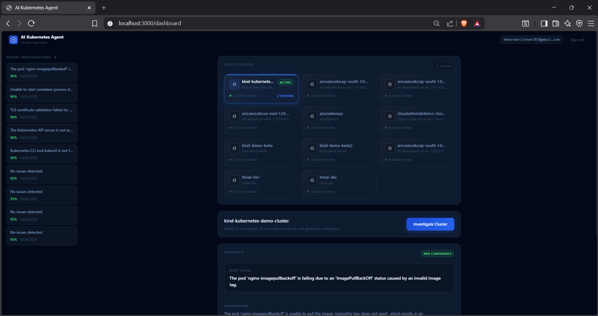
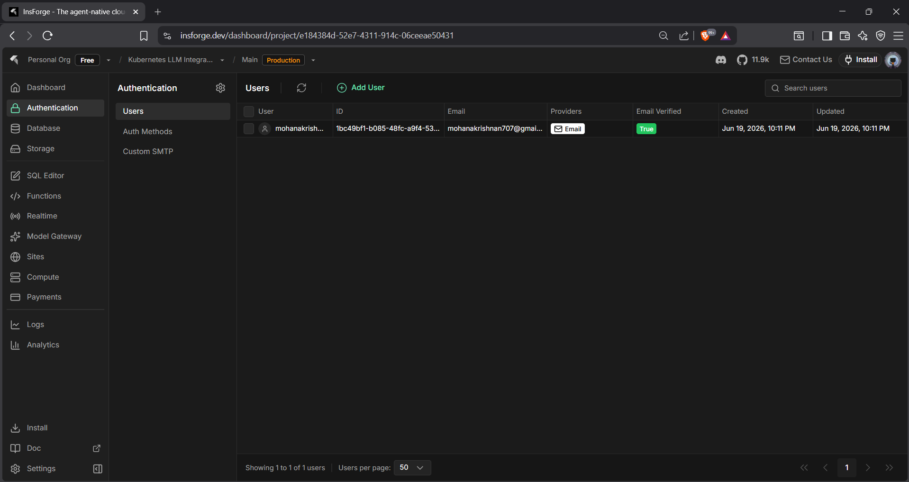
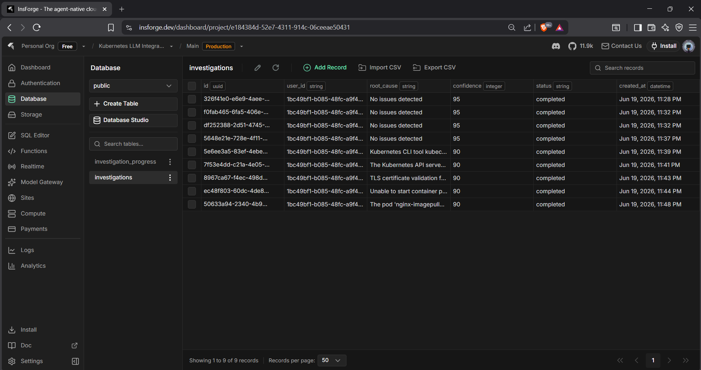
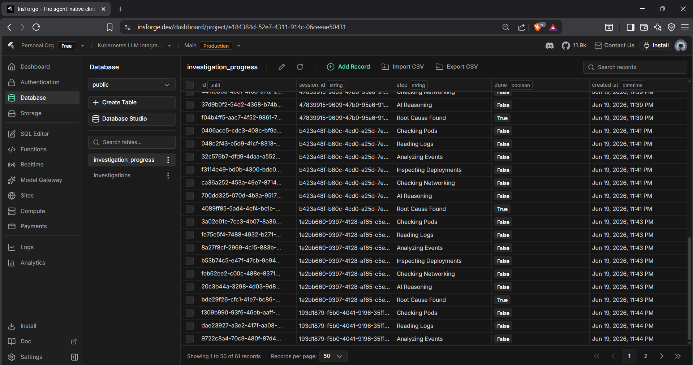

# AI Kubernetes Agent 🤖

An AI-powered Kubernetes troubleshooting agent that investigates cluster failures, analyzes logs and events, identifies root causes, and suggests fixes using LLM reasoning.

> Built with Amazon Q Developer + InsForge + OpenRouter

---

## Demo Screenshots

### Dashboard - Cluster Selection & Diagnosis


### InsForge Authentication


### Investigation History - Database


### Investigation Progress - Real-time Steps


---

## Tech Stack

| Layer | Technology |
|-------|-----------|
| Frontend | Next.js 14, TypeScript, Tailwind CSS |
| Backend | FastAPI, Python 3.12 |
| AI/LLM | OpenRouter (GPT-4o-mini) via InsForge |
| Auth & DB | InsForge (PostgreSQL + Auth) |
| Container | Docker, Docker Compose |
| K8s Access | kubectl |

---

## Features

- 🔍 Multi-cluster support via kubeconfig
- 🧠 AI-powered root cause analysis with confidence scoring
- 📊 Real-time investigation progress tracking
- 💾 Investigation history stored in InsForge PostgreSQL
- 🔐 User authentication via InsForge
- 🛠️ Suggested kubectl fixes with prevention tips

---

## Supported Kubernetes Problems

- CrashLoopBackOff
- ImagePullBackOff / ErrImagePull
- OOMKilled / Resource Exhaustion
- Pending Pods
- StartError / OCI Runtime Errors
- Deployment Rollout Failures
- Service Selector Mismatch
- DNS Resolution Problems
- Readiness/Liveness Probe Failures

---

## Architecture

```text
User → Frontend (Next.js)
         → FastAPI Backend
              → Investigation Layer (kubectl)
                   → AI Agent (OpenRouter LLM)
                        → InsForge (Auth + DB + Realtime)
                             → Diagnosis Result → User
```

---

## Built With

- [Amazon Q Developer](https://aws.amazon.com/q/developer/) - AI coding assistant
- [InsForge](https://insforge.dev) - Backend as a Service  
- [OpenRouter](https://openrouter.ai) - LLM API gateway

---

## Source Code

Full source code available in the [dev branch](https://github.com/Mohan006007/ai-kubernetes-agent/tree/dev)

---

## Author

**Mohanakrishnan A G**
- GitHub: [@Mohan006007](https://github.com/Mohan006007)
